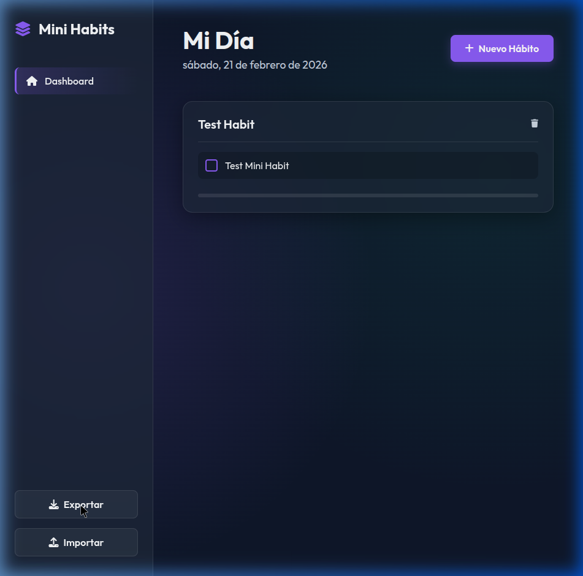
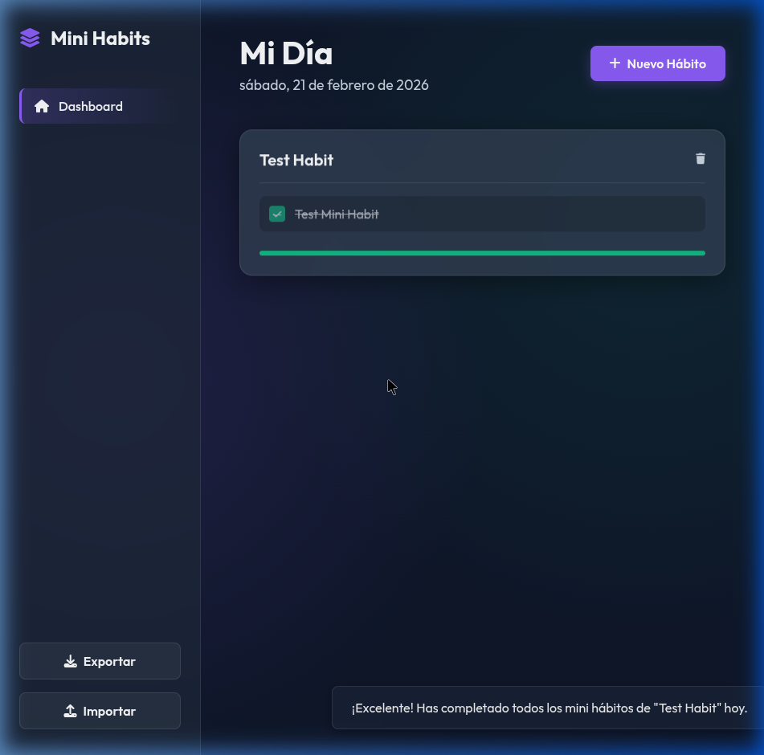

# Mini Habits Suite 🚀

Mini Habits Suite es una aplicación web moderna, progresiva y sin dependencias diseñada para ayudarte a construir y mantener buenos hábitos dividiéndolos en pequeñas tareas diarias manejables. 

Cuenta con una estética premium basada en *glassmorphism*, modo oscuro y animaciones fluidas, operando 100% de manera local en tu navegador con almacenamiento en caché persistente.

## 📸 Galería

| Dashboard Principal | Mini Hábito Completado |
| :---: | :---: |
|  |  |

## ✨ Características Principales

*   **Arquitectura Jerárquica:** Crea Hábitos "Maestros" (Ej: Ponerse en forma) y divídelos en "Mini Hábitos" accionables (Ej: 10 flexiones, tomar 2L de agua).
*   **Visualización de Progreso:** Barras de progreso dinámicas que se actualizan en tiempo real conforme completas tus tareas del día.
*   **Diseño Premium (UI/UX):** Estilo moderno oscuro con efectos de cristal translucido (backdrop-filter), acentos vibrantes, accesibilidad semántica y completamente responsivo a dispositivos móviles o de escritorio.
*   **Privacidad Total:** Todos los datos se guardan en el `localStorage` de tu navegador; nada se envía a servidores externos.
*   **Módulo de Importación/Exportación:** Respalda tu progreso en un archivo `.json` o transfiérelo a otro dispositivo fácilmente con un par de clics.
*   **Sistema de Notificaciones:** Alertas sutiles tipo *Toast* confirman cada acción importante.

## 🛠️ Tecnologías Empleadas (Vanilla Core)

Este proyecto está construido sin *frameworks* pesados para una carga instantánea y mantenimiento nulo:

*   **HTML5 Semántico**: Para una estructura limpia y accesible.
*   **CSS3 (Vanilla)**: Con variables globales (`:root`), Flexbox, Grid, Animaciones por *Keyframes* y tipografía externa (`Outfit` de Google Fonts). Íconos integrados de *FontAwesome*.
*   **JavaScript Moderno (ES6+)**: Lógica limpia con manipulación directa del DOM, manejo de arreglos en formato JSON y eventos interactivos nativos.

## 🚀 Instalación y Uso

Dado que es una aplicación que se ejecuta en el lado del cliente (frontend), no necesitas compilar nada ni instalar dependencias con `npm`.

1. Clona o descarga el repositorio a tu máquina local:
   ```bash
   git clone https://github.com/tu-usuario/MiniHabits.git
   ```
2. Navega a la carpeta del proyecto.
3. Abre el archivo `index.html` en cualquier navegador web moderno (Chrome, Firefox, Safari, Edge).
   * También puedes usar una extensión como *Live Server* de VS Code para una mejor experiencia de desarrollo.

## 💾 Respaldo y Recuperación de Datos

1. **Exportar Datos**: Haz clic en el botón inferior izquierdo de "**Exportar**". Esto descargará un archivo `minihabits_backup_YYYY-MM-DD.json` en tu carpeta de descargas con todo tu historial intacto.
2. **Importar Datos**: Haz clic en "**Importar**", selecciona tu archivo `json` previamente guardado, y tu sesión se restaurará instantáneamente como si nunca hubiera pasado el tiempo.

## 📝 Próximas Mejoras (Roadmap)

*   [ ] Estadísticas semanales y mensuales de progreso.
*   [ ] Modo edición para modificar hábitos existentes.
*   [ ] Integración Opcional de Firebase o Supabase para sincronización en la nube mediante cuenta de usuario.
*   [ ] Internacionalización (Soporte multilingüe).

---
Desarrollado con 💜.
